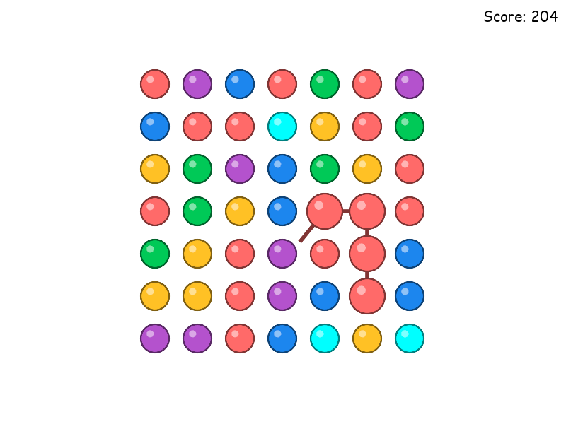

LOVE-7x7
========

A clone of [DOTS](http://weplaydots.com/), a somewhat popular mobile game.

Written in [MoonScript](http://moonscript.org/) with the [LÖVE](http://love2d.org/) framework.

Download
--------

Up-to-date build thanks to [StackMachine](https://stackmachine.com/)
* [Windows](https://stackmachine.com/games/80d60da20c0780b5230007df/download/windows) (never tested)
* [OSX](https://stackmachine.com/games/80d60da20c0780b5230007df/download/osx)
* [.love](https://stackmachine.com/games/80d60da20c0780b5230007df/download/love)

Controls
--------

- Click and drag to select points of similar color.
- Up/Down arrow: change grid size.

Screenshots
-----------

